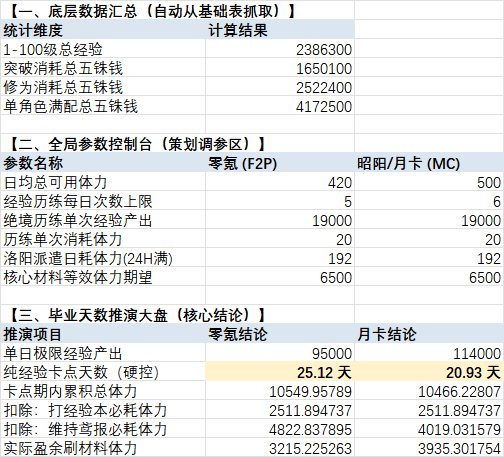

# 《代号鸢》底层数值架构与经济系统拆解

**本项目为个人游戏数值设计作品集，深度拆解了《代号鸢》的核心养成卡点与商业化闭环。**

## 📊 核心产出
1. **全链路养成模型：** 逆推1-100级、满修为的精准资源缺口。
2. **自动化推演大盘：** 基于VBA与Excel公式构建的参数控制台。
3. **卡点验证：** 量化得出F2P玩家“25天等级硬控与3200体力缺口”的商业化压迫感。

## 👁️ 模型大盘预览
*(在这里插入你刚才上传的截图)*

## 📂 文件下载
点击上方 `《代号鸢》底层数值架构与拆解.xlsx` 获取完整数值工程文件。
